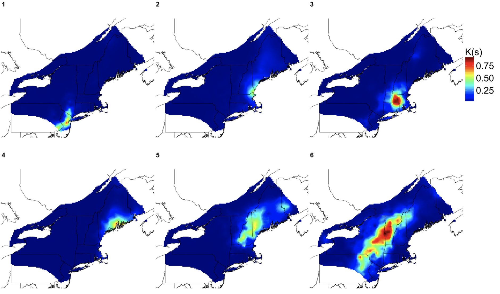

## Characterization of SARS-CoV-2 Aerosols Dispersed During Noninvasive Respiratory Support of Patients With COVID-19.

COVID-19, caused by SARS-CoV-2, was declared a pandemic in March 2020, primarily spreading through respiratory particles. Noninvasive respiratory support (NRS) therapies, like high-flow nasal cannula (HFNC) and noninvasive ventilation (NIV), were crucial for patient care, yet their impact on aerosol dispersion was unclear. Previous studies have shown varying levels of aerosol dispersal during NRS use, but many indicated limited evidence of increased risk, especially concerning COVID-19. This study aimed to assess aerosol dispersion from COVID-19 patients using NRS therapies through air sample collection and controlled measurements. The findings will help inform clinical practices and safety protocols for healthcare providers.

Ramsey, M. E., Faugno, A. J., Puryear, W. B., Lee, B. C., Foss, A. D., Lambert, L. H., Frances, F. E., **Bopp, G. P.** & Hill, N. S. (2023). Characterization of SARS-CoV-2 Aerosols Dispersed During Noninvasive Respiratory Support of Patients With COVID-19. Respiratory Care, 68(1), 8-17. [`https://doi.org/10.4187/respcare.10340`](https://doi.org/10.4187/respcare.10340)

## Max-Infinitely Divisible Spatial Model for Extremes

Traditional models for dependent extremes, max-stable processes, are unable to capture weakening spatial dependence at extreme levels. This research investigages a new class of hierarchical Bayesian models that can span both asymptotic dependence and independence classes. The model enables scalable inference for large datasets and accurately identifies intrinsic spatial patterns of extremes, akin to the way that principal component analysis identifies the directions of greatest variability about the mean.

**Bopp, G. P.**, Huser, R., Shaby, B. A. (2021). A Hierarchical Max-Infinitely Divisible Spatial Model for Extreme Precipitation. Journal of the American Statistical Association, DOI: 10.1080/01621459.2020.1750414.  [`https://doi.org/10.1080/01621459.2020.1750414`](https://doi.org/10.1080/01621459.2020.1750414)

